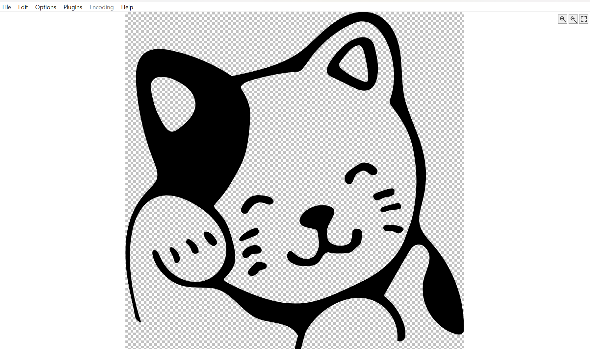

# svg_wlx

-----

**svg_wlx** is a [Total Commander](https://www.ghisler.com/index.htm) Lister
(WLX) plugin that renders SVG files inline in the Lister/Quick View panel,
and as file-list thumbnail previews.

This is a fork of the original
[svg_wlx by Rocco Matano](https://github.com/RoccoMatano/svg_wlx), with the
rendering backend replaced by [LunaSVG](https://github.com/sammycage/lunasvg)
(and its bundled [PlutoVG](https://github.com/sammycage/plutovg) rasterizer)
for much broader SVG compatibility — see [DIST_README.md](DIST_README.md)
for the full write-up of what changed, and [CHANGELOG.md](CHANGELOG.md) for
the release history.

I wrote it because I wanted something similar to
[svgthumb](https://github.com/FrankEBailey/svgthumb), just a little
different.

Features
--------

- Renders SVGs with support for text, `<use>`/`<symbol>`, `<clipPath>`,
  `<mask>`, `<pattern>`, embedded `<image>`, and CSS/`<style>` styling —
  not just basic shapes.
- Interactive **zoom and pan**: mouse wheel or **+**/**-** to zoom
  (10%-800%, centered on the cursor), click-and-drag to pan, on-screen
  zoom/fit buttons, **F** or double-click to reset to fit-to-window. An
  SVG smaller than the window opens at its native size instead of being
  stretched.
- Transparent backgrounds render as a light/dark checkerboard (the usual
  image-editor convention), configurable via `svg_wlx.ini`.
- Detects SMIL/CSS-animated SVGs and shows a small notice that only the
  first frame is displayed, rather than silently freezing the animation.
- Stays sharp across window resizes and DPI changes — it re-rasterizes
  the vector source at the new size instead of stretching a fixed bitmap.
- Both binaries are statically linked with no runtime dependencies beyond
  standard Windows DLLs (`KERNEL32`, `USER32`, `GDI32`).

Installation
------------

Grab a release `.zip` and drag it onto the Total Commander window to
install (or install manually) — see
[DIST_README.md](DIST_README.md#installation) for details, and
[DIST_README.md](DIST_README.md#configuration) for the optional
`svg_wlx.ini` settings.

Building from source
---------------------

Open `svg_wlx.sln` in Visual Studio and build the `Release` configuration
for `Win32` and/or `x64` — no Python, SCons, or other tooling required
beyond a standard MSVC C++ toolchain. LunaSVG and PlutoVG are vendored
under `third_party/` and build as part of the same project.

Credits and license
--------------------

svg_wlx is MIT-licensed — see [LICENSE](LICENSE). It renders SVGs using
[LunaSVG](https://github.com/sammycage/lunasvg) (MIT license) and its
bundled [PlutoVG](https://github.com/sammycage/plutovg) rasterizer (MIT
license, includes FreeType-derived rasterizer/stroker code under the
FreeType License and vendored `stb_image`/`stb_truetype`), statically
linked in — see [THIRD_PARTY_NOTICES.md](THIRD_PARTY_NOTICES.md) for full
license texts.
